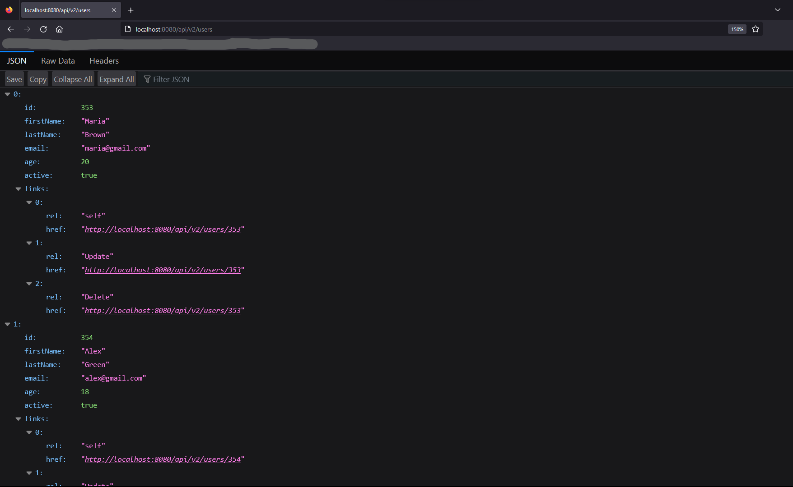
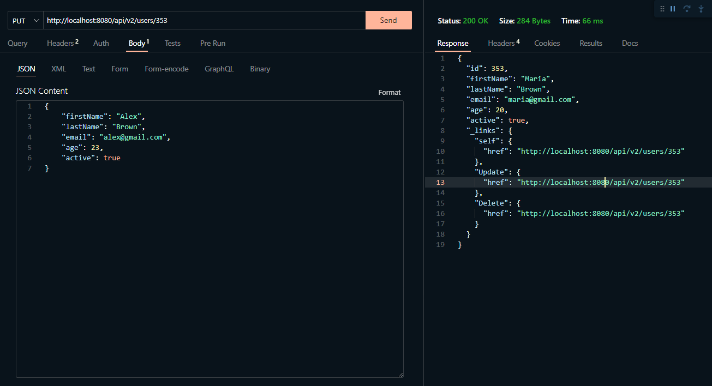

# CMAS Interview Project 2023

## Project Overview
This is a simple java project using Spring and Maven developed during my internship. It is a basic RESTful API with CRUD operations.

## Features
* CRUD operations for User entity through the REST API.
* HATEOAS architecture.
* Exception handling with [Problem](https://github.com/zalando/problem-spring-web) from [Zalando](https://github.com/zalando).
* Connection to a PostgreSQL database.
* Simple Tests using Mockito BDD.
* [Lombok](https://projectlombok.org/) to avoid unnecessary boilerplate. 

 

---
## Usage
Manage a simple database using RESTful API

After running the project go to any browser and make a request to the API 

* remember that browsers normaly only allow GET requests

 

Use any http request application to use PUT, DELETE, and INSERT

 

## Installation
#### **This project requires the following:**
* Java (version 17 or higher).
* Maven.
* PostgreSQL database.

After downloading this project you first need to configure the application properties and set up the connection for your database at:

    ../src/main/resources/application.yaml

After configuration you can run the project.

---
## Author
André Viola